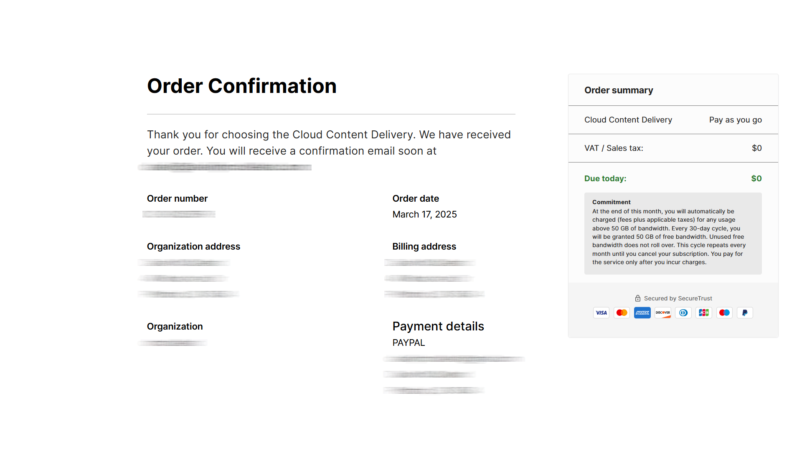

# Cloud Content Delivery

This can be a way to distribute content modules to a common content platform.&#x20;

Access Cloud Content Delivery from the Products menu on the Left.

<figure><figcaption></figcaption></figure>

When first launched it will show an overview like the DevOps did. Click Launch in the overview page to load the Product Details page where you can purchase a free tier of the service.

<figure><figcaption></figcaption></figure>

The purchase is mapped to an organization. Therefore, if one organization has been created to contain a project, that is the organization to be selected. An address must already have been added to the organization profile: the payment page will display address fields if it is not already filled out, but page validation will not succeed even if it is fully filled in the Content Delivery signup form. Financial information is required to be given at this stage because if the free tier threshold is exceeded in the defined period it converts to a paygo plan:

<figure><figcaption></figcaption></figure>

